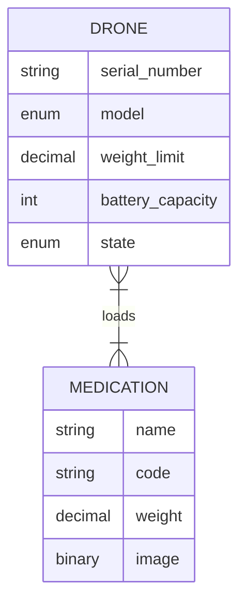
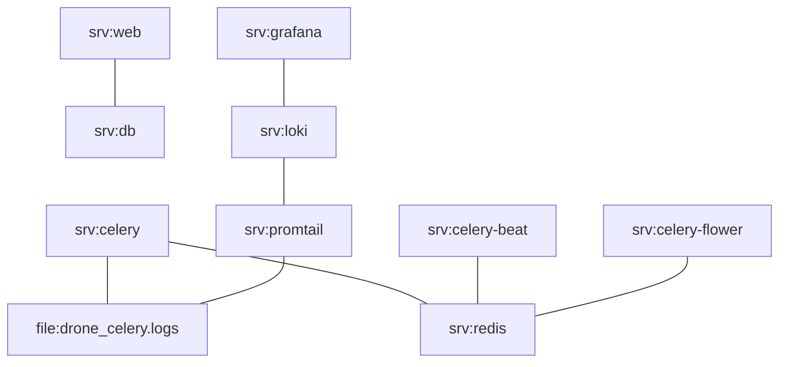

# Description

This is an implementation of a simple project to manage a drone fleet and the medications they will carry.



# Requisites

| App               | We used the version    |
| ----------------- | ---------------------- |
| Python 3          | 3.9                    |
| Docker            | 18.09.7, build 2d0083d |
| Docker Compose    | 1.29.2                 |


# Run locally
- Create a virtual environment to isolate our package dependencies locally.
    - `python3 -m venv env`
    - `source env/bin/activate`
- Install Django and Django REST framework into the virtual environment.
    - `pip install -r requirements`
- Apply migrations
    - `./manage.py migrate`
- Create Django's superuser
    - `./manage.py createsuperuser --email <ADMIN_EMAIL> --username <ADMIN_USERNAME>`

> At this point, you will be able to run the project and the tests.

- Run Server
    - `./manage.py runserver`
- Run Tests
    - `./manage.py test`

# Run via Docker

- Start the services:
    - `docker-compose up`
    > The first time you run `docker-compose up`, you will need to create Django's superuser: `docker-compose exec web python manage.py createsuperuser`.
- Stop the services:
    - `docker-compose down`

In the following diagram, you can see the relation between the different services.



> **Note**: Every 10 seconds will be executed a periodic task to check the battery of each drone. The resulting information will be stored in `drone_celery.logs`.


## Logs visualization

The logs generated by the periodic task that checks drones' battery is stored in `logs/drone_celery.logs`.

You can use command-line tools to monitor the content and changes of the log file or use a web app like Grafana.

To visualize the logs using Grafana, please follow the following steps:

### Grafana

- Access Grafana:
    - URL: http://localhost:3000/
    - Credentials: admin/admin (You can change it after the first login)

- Configure the data source:
    > In this case, we will configure a Loki data source.
    - Go to `Configuration > Data sources`
    - Click on `Add data source`
    - Select `Loki`
        > In the configuration form of Loki.
        - URL: http://loki:3100
        - Click on `Save & test`
            > Should appear the message `Data source connected and labels found.` if it was connected successfully.

- Create the dashboard
    - Go to `Create > Import`
    - Import dashboard via grafana.com
        - Id of dashboard: [13639](https://grafana.com/grafana/dashboards/13639)
        - Click on `Load`
        - Select the Loki data source imported previously in the combo box that appears at the bottom.
        - Click on `Import`

- Visualize the dashboard
    - Go to `Search dashboards`
    - Select the dashboard named `Logs / App`
    > Now you should be able to see the logs :)

# Examples consuming the endpoints

- Register a drone.

```bash
curl -X POST \
  http://127.0.0.1:8000/api/v1/drones/ \
  -H 'content-type: application/json' \
  -d '{
    "serial_number": "drone_12",
    "model": "Lightweight",
    "weight_limit": "200.00",
    "battery_capacity": 100,
    "state": "IDLE",
    "medications": []
}'
```

- Check the loaded medication items for a given drone. 

```bash
curl -X GET http://127.0.0.1:8000/api/v1/drones/1/medications/
```

- Get the list of medications.

```bash
curl -X GET http://127.0.0.1:8000/api/v1/medications/
```

- Create a medication

``` bash
curl -X POST \
    http://127.0.0.1:8000/api/v1/medications/ \
    -F image=@<IMAGE> \
    -F name=med_08 \
    -F weight=12 \
    -F code=COD_08
```

- Load a drone with medication items.

```bash
curl -X PUT \
  http://127.0.0.1:8000/api/v1/drones/1/medications/ \
  -H 'content-type: application/json' \
  -d '[5]'
```

- Check the available drones for loading.

```bash
curl -X GET \
  http://127.0.0.1:8000/api/v1/drones/available/
```

- Check the battery level for a given drone.

```bash
curl -X GET \
  http://127.0.0.1:8000/api/v1/drones/1/battery/
```


